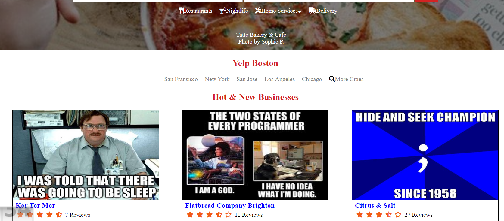

# Yelp Recreation
This website was recreated from a PDF image of an existing site that's no longer live. The goal was to first recreate the Site's HTML & CSS and then make it responsive using CSS. I took some artistic liberties with the images instead of going with the ones in the original PDF.

Demo-site: https://charlesdefarias.github.io/Yelp/

## How It's Made:

**Tech used:** HTML, CSS

This was a simple HTML/CSS website.

## Optimizations
There's a lot I still want to do to this site to be satisfied with it. I think things would look better with less borders, word spacings and colors are off, the icons could look better and the text alignments are a bit off as well.

## Lessons Learned:

This was my first time using Media Queries with so many images, which was an obnoxious challenge but not as difficult as I expected. That said, my responsiveness needed a lot of work when I finished this.
